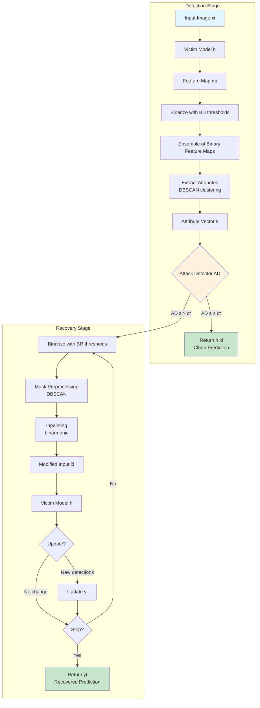

# Saliuitl Pipeline Diagram

## Mermaid形式



## ASCII形式（スライド用）

```
┌─────────────────────────────────────────────────────────────────────┐
│                        DETECTION STAGE                               │
├─────────────────────────────────────────────────────────────────────┤
│                                                                      │
│   ┌──────────┐    ┌──────────┐    ┌──────────────┐                  │
│   │  Input   │───▶│  Victim  │───▶│ Feature Map  │                  │
│   │ Image xi │    │ Model h  │    │     mi       │                  │
│   └──────────┘    └──────────┘    └──────┬───────┘                  │
│                                          │                          │
│                                          ▼                          │
│                               ┌──────────────────┐                  │
│                               │ Binarize with BD │                  │
│                               │ (20 thresholds)  │                  │
│                               └────────┬─────────┘                  │
│                                        │                            │
│                                        ▼                            │
│   ┌──────────────────────────────────────────────────────────┐     │
│   │           Ensemble of Binary Feature Maps                 │     │
│   │  β=0.05  β=0.10  β=0.15  ...  β=0.95                     │     │
│   │   [▓▓]    [▓▓]    [▓▓]        [▓▓]                       │     │
│   └──────────────────────────┬───────────────────────────────┘     │
│                              │                                      │
│                              ▼                                      │
│                    ┌───────────────────┐                           │
│                    │ Extract Attributes│                           │
│                    │ (DBSCAN × 4 attrs)│                           │
│                    └─────────┬─────────┘                           │
│                              │                                      │
│                              ▼                                      │
│                    ┌───────────────────┐                           │
│                    │ Attribute Vector s│                           │
│                    │ s ∈ ℝ^(4×20)      │                           │
│                    └─────────┬─────────┘                           │
│                              │                                      │
│                              ▼                                      │
│                    ┌───────────────────┐                           │
│                    │  Attack Detector  │                           │
│                    │   AD (1D-CNN)     │                           │
│                    └─────────┬─────────┘                           │
│                              │                                      │
│                    ┌─────────┴─────────┐                           │
│                    ▼                   ▼                            │
│           ┌──────────────┐   ┌──────────────┐                      │
│           │ AD(s) ≤ α*   │   │ AD(s) > α*   │                      │
│           │ (Clean)      │   │ (Attacked)   │                      │
│           └──────┬───────┘   └──────┬───────┘                      │
│                  │                  │                               │
│                  ▼                  │                               │
│           ┌──────────────┐          │                               │
│           │ Return h(xi) │          │                               │
│           └──────────────┘          │                               │
│                                     │                               │
└─────────────────────────────────────┼───────────────────────────────┘
                                      │
                                      ▼
┌─────────────────────────────────────────────────────────────────────┐
│                        RECOVERY STAGE                                │
├─────────────────────────────────────────────────────────────────────┤
│                                                                      │
│            ┌───────────────────────────────────┐                    │
│            │   for βr in BR (descending):     │◀─────┐             │
│            └─────────────────┬─────────────────┘      │             │
│                              │                        │             │
│                              ▼                        │             │
│                    ┌───────────────────┐              │             │
│                    │ Binarize Feature  │              │             │
│                    │ Map with βr       │              │             │
│                    └─────────┬─────────┘              │             │
│                              │                        │             │
│                              ▼                        │             │
│                    ┌───────────────────┐              │             │
│                    │ Mask Preprocessing│              │             │
│                    │ (DBSCAN outlier   │              │             │
│                    │  removal)         │              │             │
│                    └─────────┬─────────┘              │             │
│                              │                        │             │
│                              ▼                        │             │
│                    ┌───────────────────┐              │             │
│                    │   Inpainting      │              │             │
│                    │  (biharmonic)     │              │             │
│                    └─────────┬─────────┘              │             │
│                              │                        │             │
│                              ▼                        │             │
│                    ┌───────────────────┐              │             │
│                    │ Modified Input x̂i │              │             │
│                    └─────────┬─────────┘              │             │
│                              │                        │             │
│                              ▼                        │             │
│                    ┌───────────────────┐              │             │
│                    │   Victim Model    │              │             │
│                    │      h(x̂i)        │              │             │
│                    └─────────┬─────────┘              │             │
│                              │                        │             │
│                    ┌─────────┴─────────┐              │             │
│                    ▼                   ▼              │             │
│           ┌──────────────┐   ┌──────────────┐        │             │
│           │ New objects  │   │ No change    │        │             │
│           │ detected?    │   │              │        │             │
│           └──────┬───────┘   └──────┬───────┘        │             │
│                  │                  │                │             │
│                  ▼                  │                │             │
│           ┌──────────────┐          │                │             │
│           │ Update ŷi    │          │                │             │
│           └──────┬───────┘          │                │             │
│                  │                  │                │             │
│                  └────────┬─────────┘                │             │
│                           │                          │             │
│                           ▼                          │             │
│                  ┌──────────────────┐                │             │
│                  │ Stop condition?  │                │             │
│                  │ - Mask > 50%     │                │             │
│                  │ - Label changed  │                │             │
│                  │ - All βr done    │                │             │
│                  └────────┬─────────┘                │             │
│                           │                          │             │
│              ┌────────────┴────────────┐             │             │
│              ▼                         ▼             │             │
│       ┌────────────┐           ┌────────────┐        │             │
│       │    YES     │           │     NO     │────────┘             │
│       └─────┬──────┘           └────────────┘                      │
│             │                                                       │
│             ▼                                                       │
│       ┌────────────┐                                               │
│       │ Return ŷi  │                                               │
│       │ (Recovered │                                               │
│       │ Prediction)│                                               │
│       └────────────┘                                               │
│                                                                      │
└─────────────────────────────────────────────────────────────────────┘
```

## 4属性の説明

| 属性 | 説明 |
|------|------|
| # Active Neurons | 二値化後の1の数 |
| # Clusters | DBSCANで検出されたクラスタ数 |
| Mean Intra-cluster Distance | クラスタ内平均距離の平均 |
| Std Intra-cluster Distance | クラスタ内平均距離の標準偏差 |

## パラメータ

| パラメータ | デフォルト値 | 説明 |
|-----------|-------------|------|
| \|BD\| = \|BR\| | 20 | 閾値セットサイズ (100/ensemble_step) |
| α* | 0.5 | 攻撃検出閾値 |
| ε (DBSCAN) | 1.0 | クラスタリング半径 |
| nmin (DBSCAN) | 4 | 最小クラスタサイズ |
| neulim | 0.5 | インペインティング上限（画像の50%） |
